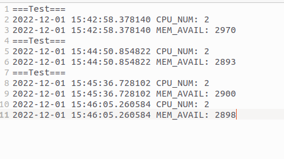
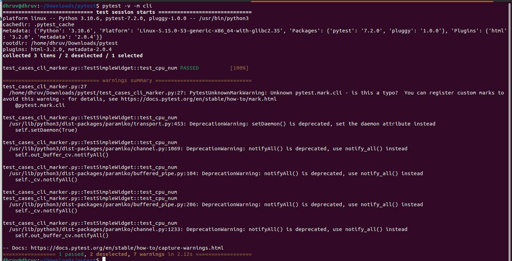
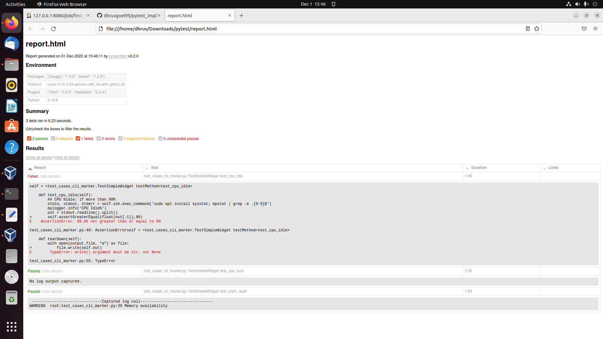
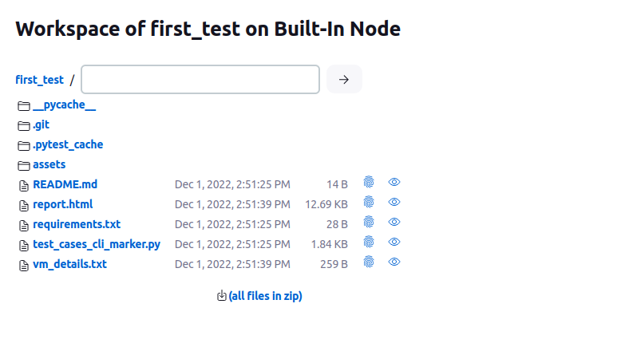

# pytest_impl

## access marker testcase

pytest -v -m "marker-name"

## access html report
  
pytest --html=report.html

## artifacts in jenkins

Have a look to report and VM_details.txt, in artifacts
